# 🚀 LeadFlow

> A full-stack lead management platform designed to help teams capture, organize, track, and manage leads through their complete lifecycle.

LeadFlow is a production-style **Lead Management System** built as a full-stack engineering assessment. It provides a public lead-capture experience and an authenticated dashboard where team members can manage leads, activities, notes, and lead status.

The application focuses on:

* Clean and scalable architecture
* Role-based access control
* Secure authentication
* RESTful JSON APIs
* Lead lifecycle management
* Relational data modeling
* Automated testing
* Responsive UI
* Production-ready deployment

---

## 📌 Table of Contents

* [Overview](#-overview)
* [Features](#-features)
* [Tech Stack](#-tech-stack)
* [System Architecture](#-system-architecture)
* [Application Flow](#-application-flow)
* [Lead Lifecycle](#-lead-lifecycle)
* [User Roles](#-user-roles)
* [Database Architecture](#-database-architecture)
* [Entity Relationship Diagram](#-entity-relationship-diagram)
* [API Architecture](#-api-architecture)
* [Authentication Flow](#-authentication-flow)
* [Project Structure](#-project-structure)
* [Testing Strategy](#-testing-strategy)
* [Security](#-security)
* [Error Handling](#-error-handling)
* [Deployment Architecture](#-deployment-architecture)
* [Environment Variables](#-environment-variables)
* [Getting Started](#-getting-started)
* [Development Workflow](#-development-workflow)
* [Future Improvements](#-future-improvements)
* [Engineering Decisions](#-engineering-decisions)
* [Author](#-author)

---

# 🎯 Overview

LeadFlow solves a common business problem: managing leads from the moment they are captured until they are converted, lost, or otherwise closed.

The system supports two primary experiences:

### Public Experience

A visitor can submit their information through a public lead-capture form.

```text
Visitor
   │
   ▼
Public Lead Form
   │
   ▼
Validation
   │
   ▼
Lead API
   │
   ▼
PostgreSQL
```

### Internal Experience

Authenticated team members can access the LeadFlow dashboard to manage leads.

```text
User
 │
 ▼
Login
 │
 ▼
Authentication
 │
 ▼
Role Authorization
 │
 ▼
Dashboard
 │
 ├── View Leads
 ├── Create Leads
 ├── Update Leads
 ├── Add Notes
 ├── Track Activities
 └── Manage Lead Status
```

---

# ✨ Features

## Lead Management

* Create leads
* View leads
* Update lead information
* Delete leads
* Search and filter leads
* Track lead status
* Track lead ownership
* Maintain lead history

## Lead Lifecycle

LeadFlow supports a structured lead lifecycle:

```text
NEW
 │
 ▼
CONTACTED
 │
 ▼
QUALIFIED
 │
 ├──────────────► LOST
 │
 ▼
CONVERTED
```

This allows teams to understand where every lead currently stands.

---

## Notes & Activities

Each lead can have associated notes and activities.

Examples:

* Follow-up calls
* Emails
* Meetings
* Status changes
* Internal notes
* Customer interactions

This creates a historical record around the lead instead of treating the lead as only a static database record.

---

## Authentication

Authenticated users can access the internal application.

The application separates:

* Authentication
* Authorization
* User roles
* Protected resources

---

## Role-Based Access Control

LeadFlow supports different levels of access.

### Admin

Admins can perform administrative operations such as:

* Manage leads
* Manage users
* Access protected resources
* Perform administrative actions

### Member

Members can:

* View leads
* Manage assigned leads
* Add notes
* Track activities
* Update lead information according to permissions

---

# 🛠 Tech Stack

| Layer            | Technology                       |
| ---------------- | -------------------------------- |
| Frontend         | Next.js / React                  |
| Language         | TypeScript                       |
| Styling          | Tailwind CSS                     |
| Backend          | Node.js                          |
| API              | REST / JSON                      |
| ORM              | Prisma                           |
| Database         | PostgreSQL                       |
| Authentication   | JWT / secure authentication flow |
| Testing          | Jest                             |
| Containerization | Docker                           |
| Version Control  | Git / GitHub                     |
| Deployment       | Vercel / Cloud deployment        |

---

# 🏗 System Architecture

LeadFlow follows a layered full-stack architecture.

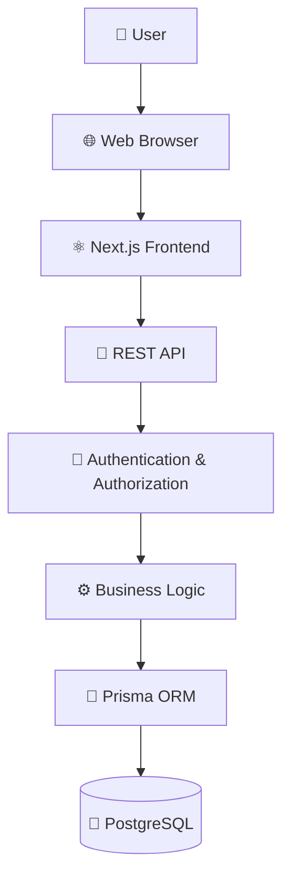

### Architecture Responsibilities

**Frontend**

Responsible for:

* User interface
* Client-side interactions
* Form handling
* API communication
* Dashboard experience

**API**

Responsible for:

* HTTP requests
* Request validation
* Authentication
* Authorization
* Response formatting

**Business Logic**

Responsible for:

* Lead lifecycle rules
* User permissions
* Notes
* Activities
* Data consistency

**Prisma**

Acts as the database abstraction layer and provides:

* Type-safe database access
* Schema management
* Relations
* Queries
* Migrations

**PostgreSQL**

Stores persistent application data.

---

# 🔄 Application Flow

## Public Lead Capture

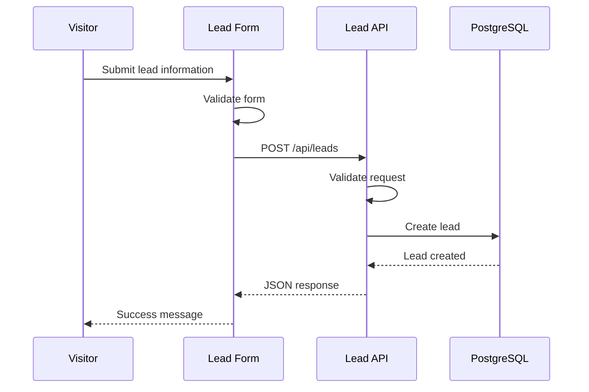

---

# 🔐 Authenticated Request Flow

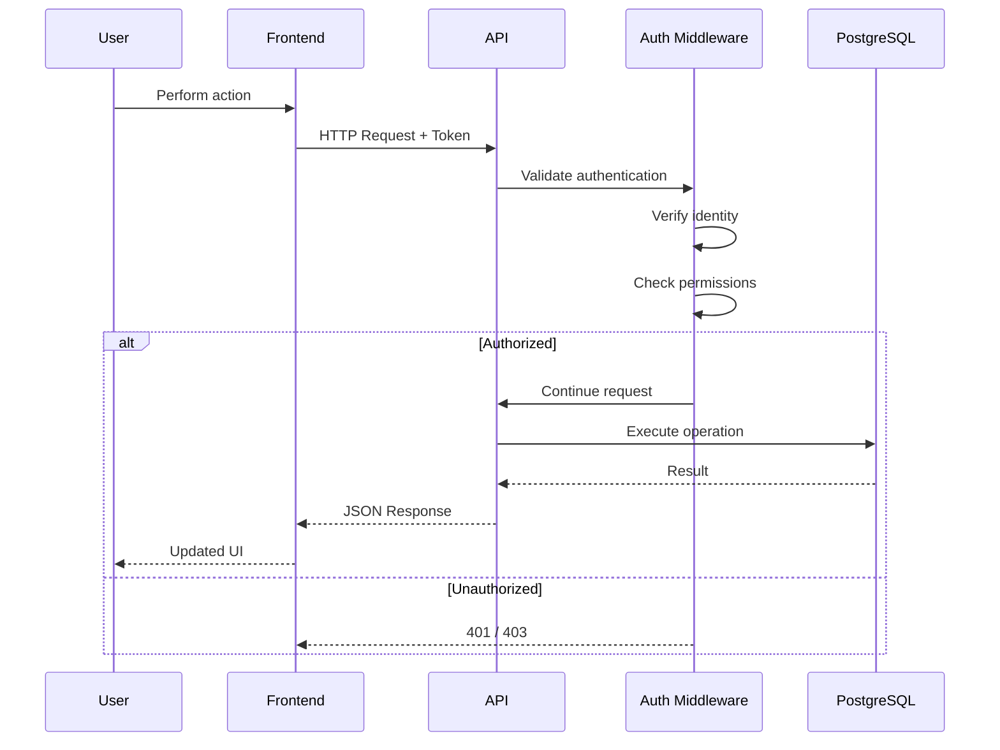

---

# 🔄 Lead Lifecycle

A lead progresses through multiple states.

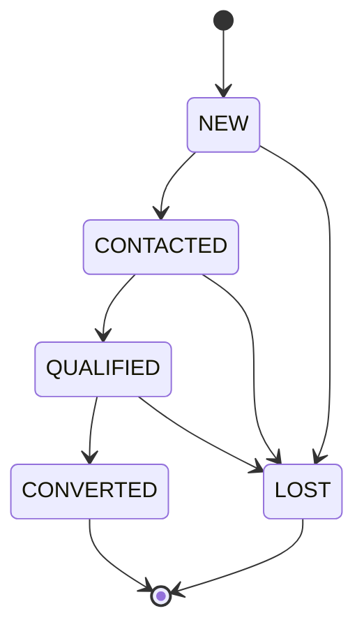

### Example

```text
New Lead
   ↓
Sales Representative contacts lead
   ↓
Lead responds
   ↓
Lead is qualified
   ↓
Sales process completes
   ↓
Converted
```

If the lead does not proceed:

```text
Lead
 ↓
Contacted
 ↓
Not interested
 ↓
Lost
```

---

# 👥 User Roles

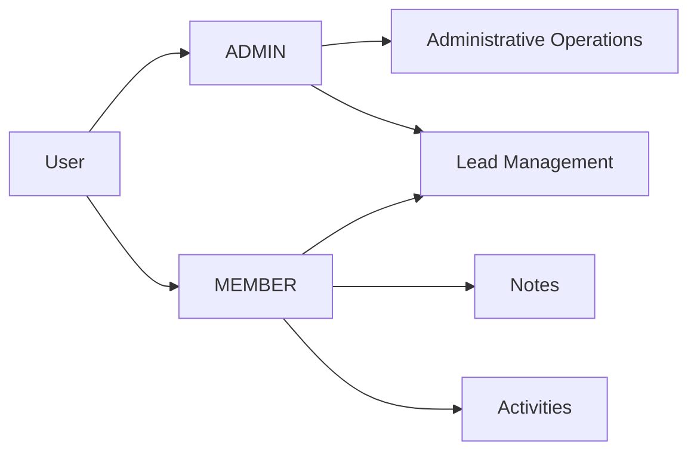

Role-based authorization prevents users from accessing operations they are not permitted to perform.

---

# 🗄 Database Architecture

The application uses PostgreSQL as the primary relational database.

The database is accessed through Prisma ORM.

Core entities include:

* User
* Lead
* Note
* Activity

---

# 🔗 Entity Relationship Diagram

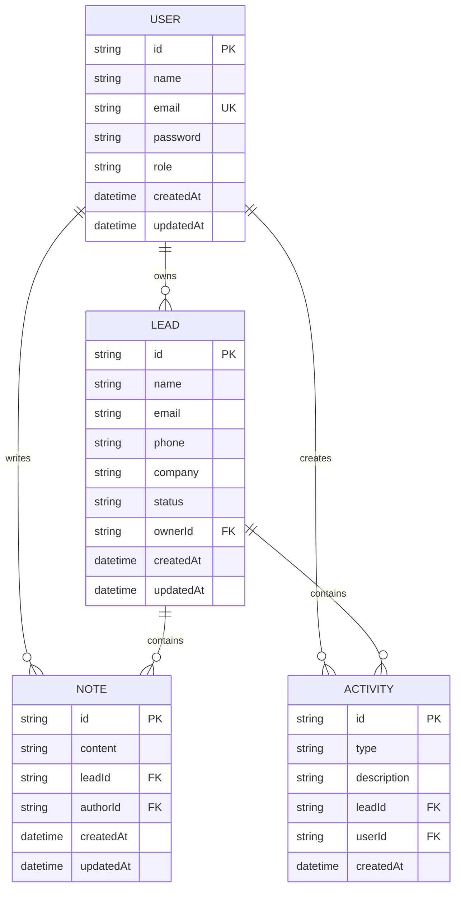

> The exact fields should always match the current Prisma schema in the repository.

---

# 🔌 API Architecture

LeadFlow exposes JSON-based API endpoints.

## Authentication

```text
POST   /api/auth/login
POST   /api/auth/register
POST   /api/auth/logout
```

## Leads

```text
GET    /api/leads
GET    /api/leads/:id
POST   /api/leads
PATCH  /api/leads/:id
DELETE /api/leads/:id
```

## Notes

```text
GET    /api/leads/:id/notes
POST   /api/leads/:id/notes
DELETE /api/notes/:id
```

## Activities

```text
GET    /api/leads/:id/activities
POST   /api/leads/:id/activities
```

> Update the endpoint names above if your final implementation uses a different route structure.

---

# 📡 Example API Flow

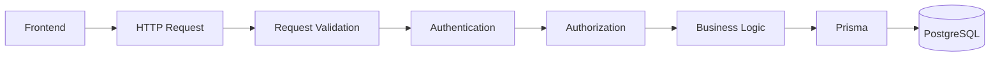

---

# 🔒 Authentication Flow

The authentication layer protects private application resources.

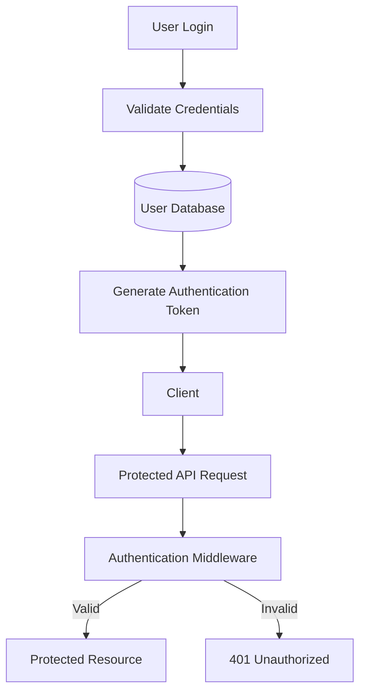

---

# 📁 Project Structure

A typical project structure:

```text
LeadFlow/
│
├── app/
│   ├── dashboard/
│   ├── leads/
│   ├── login/
│   └── ...
│
├── components/
│   ├── ui/
│   ├── leads/
│   └── ...
│
├── lib/
│   ├── auth/
│   ├── db/
│   ├── validation/
│   └── ...
│
├── prisma/
│   ├── schema.prisma
│   ├── migrations/
│   └── seed.*
│
├── tests/
│   ├── unit/
│   └── integration/
│
├── public/
│
├── Dockerfile
├── docker-compose.yml
├── package.json
├── tsconfig.json
├── tailwind.config.*
└── README.md
```

> Adjust this tree to exactly match the current repository structure.

---

# 🧪 Testing Strategy

Testing is divided into multiple layers.

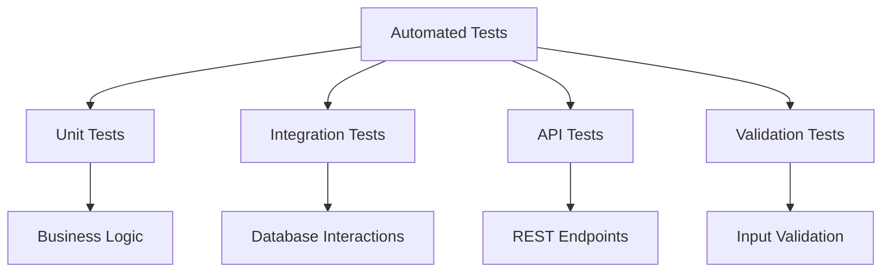

## What is tested?

### Unit Tests

Test individual functions and business rules.

### API Tests

Validate:

* HTTP status codes
* Request validation
* Authentication
* Authorization
* Response structure

### Integration Tests

Validate interactions between:

```text
API
 ↓
Business Logic
 ↓
Prisma
 ↓
PostgreSQL
```

---

# 🛡 Security

Security considerations include:

* Password hashing
* Authentication middleware
* Role-based authorization
* Input validation
* Protected API endpoints
* Environment-based secrets
* Database constraints
* Prevention of unauthorized resource access

Sensitive configuration should never be committed to Git.

---

# ⚠️ Error Handling

The API follows predictable error responses.

Example:

```json
{
  "success": false,
  "error": {
    "code": "VALIDATION_ERROR",
    "message": "Invalid lead information"
  }
}
```

Typical HTTP responses:

| Status | Meaning                  |
| ------ | ------------------------ |
| 200    | Successful request       |
| 201    | Resource created         |
| 400    | Invalid request          |
| 401    | Authentication required  |
| 403    | Insufficient permissions |
| 404    | Resource not found       |
| 409    | Resource conflict        |
| 500    | Internal server error    |

---

# 🚀 Deployment Architecture

The production architecture can be represented as:

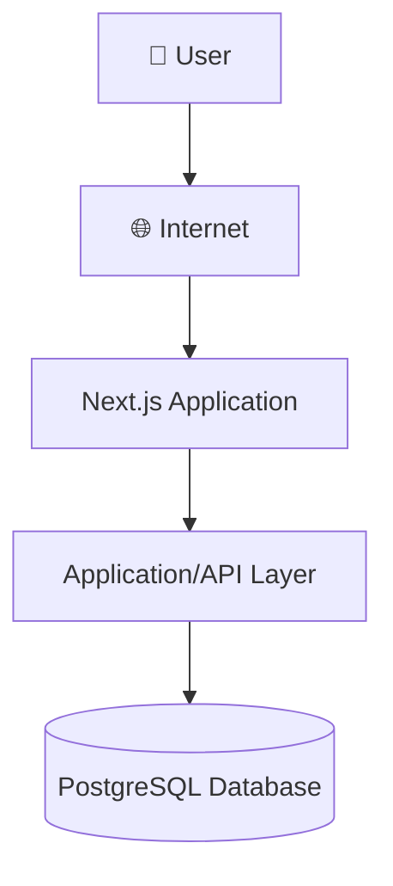

The application can be deployed using:

```text
GitHub
   │
   ▼
CI/CD
   │
   ├── Build
   ├── Test
   └── Deploy
         │
         ▼
   Production
```

---

# ⚙️ Environment Variables

Create a `.env` file locally.

```env
DATABASE_URL="your_postgresql_connection_string"

JWT_SECRET="your_secret"

NEXT_PUBLIC_API_URL="your_api_url"
```

Never commit `.env` files or production secrets.

---

# 💻 Getting Started

## 1. Clone the repository

```bash
git clone https://github.com/<your-username>/LeadFlow.git

cd LeadFlow
```

## 2. Install dependencies

```bash
npm install
```

## 3. Configure environment variables

Create:

```text
.env
```

and add the required environment variables.

## 4. Configure the database

Make sure PostgreSQL is running and `DATABASE_URL` points to the correct database.

## 5. Run Prisma

```bash
npx prisma generate
```

Run migrations:

```bash
npx prisma migrate dev
```

## 6. Start development server

```bash
npm run dev
```

The application should then be available locally.

---

# 🐳 Docker

LeadFlow can be containerized using Docker.

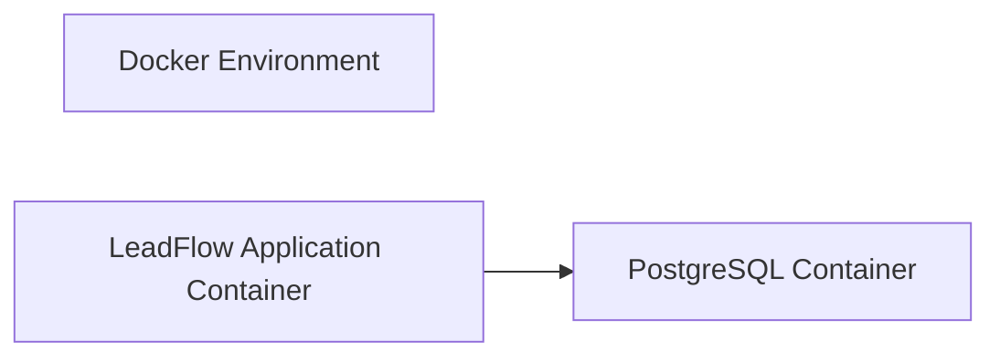

Example workflow:

```bash
docker build -t leadflow .

docker run -p 3000:3000 leadflow
```

If Docker Compose is configured:

```bash
docker compose up --build
```

---

# 🔄 Development Workflow

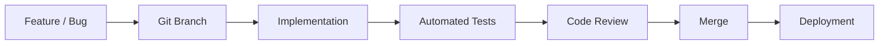

---

# 🧠 Engineering Decisions

## Relational Database

PostgreSQL was selected because the application contains strongly related entities such as:

```text
User
 │
 ├── Leads
 │     ├── Notes
 │     └── Activities
 │
 └── Activities
```

A relational database provides:

* Referential integrity
* Transactions
* Relationships
* Strong consistency
* Structured querying

---

## Prisma ORM

Prisma provides a type-safe interface between the application and PostgreSQL.

```text
Application
     │
     ▼
Prisma Client
     │
     ▼
PostgreSQL
```

This reduces repetitive SQL and provides better developer experience with TypeScript.

---

## API-Driven Architecture

Separating the frontend from the application/API layer makes the system easier to:

* Test
* Maintain
* Extend
* Integrate with other clients

The same API can potentially support:

```text
Web Application
      │
      ├── Mobile Application
      │
      ├── Admin Dashboard
      │
      └── External Integrations
```

---

# 📊 Lead Management Workflow

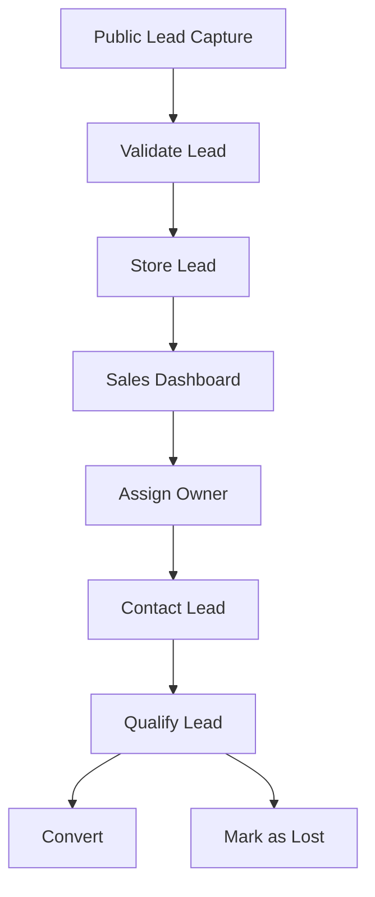

---

# 🎯 Product Goals

LeadFlow was designed around several engineering goals:

### 1. Reliability

Ensure lead information is persisted consistently.

### 2. Maintainability

Keep responsibilities separated between UI, API, business logic, and persistence.

### 3. Security

Protect authenticated resources and enforce user permissions.

### 4. Scalability

Use modular architecture so new features can be introduced without rewriting the entire system.

### 5. Developer Experience

Use TypeScript, Prisma, automated testing, and predictable API contracts to make development easier.

---

# 🔮 Future Improvements

Potential future improvements include:

* Advanced lead filtering
* Full-text search
* Lead assignment automation
* Email notifications
* Reminder system
* Activity timeline
* Analytics dashboard
* CSV import/export
* Bulk lead operations
* Audit logs
* WebSocket-based real-time updates
* Background job processing
* Redis caching
* CI/CD pipeline
* Comprehensive E2E testing

---

# 📈 Possible Scaling Architecture

For larger workloads, the architecture could evolve into:

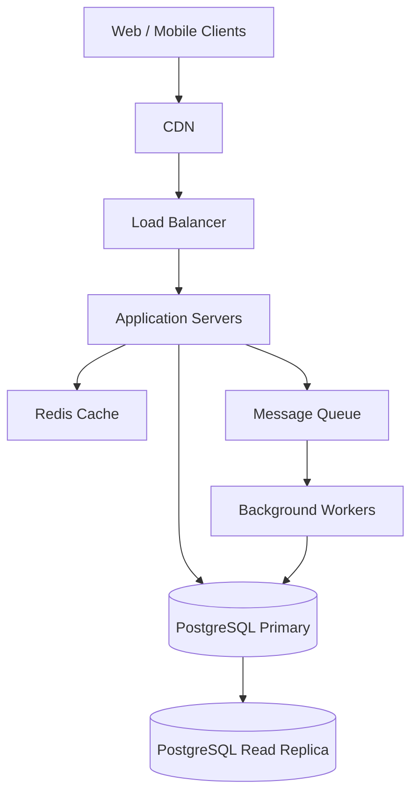

This would allow the platform to handle increased traffic while keeping expensive background work away from the request/response path.

---

# 🧩 Key Engineering Concepts Demonstrated

This project demonstrates practical experience with:

* Full-stack application development
* React / Next.js
* TypeScript
* Tailwind CSS
* REST APIs
* PostgreSQL
* Prisma ORM
* Relational database design
* Authentication
* Authorization
* RBAC
* Form validation
* CRUD operations
* API design
* Automated testing
* Docker
* Environment configuration
* Git / GitHub
* Production-oriented architecture
* Error handling
* Data integrity
* Scalable application design

---

# 🏁 Conclusion

LeadFlow demonstrates how a real-world lead management product can be designed and implemented using a modern full-stack architecture.

The project focuses not only on building UI features but also on:

```text
Product Requirements
        ↓
Architecture
        ↓
Database Design
        ↓
API Design
        ↓
Authentication
        ↓
Business Logic
        ↓
Testing
        ↓
Deployment
```

The goal was to build a system that is **maintainable, secure, testable, and extensible**, rather than simply implementing a collection of CRUD screens.

---

# 👨‍💻 Author

**Harsh Tawadwal**

Full-Stack Software Engineer

Focused on building scalable web applications using:

**React • Next.js • TypeScript • Node.js • PostgreSQL • Prisma**

---

## ⭐ If you found this project useful

Feel free to explore the repository, review the architecture, and provide feedback.
